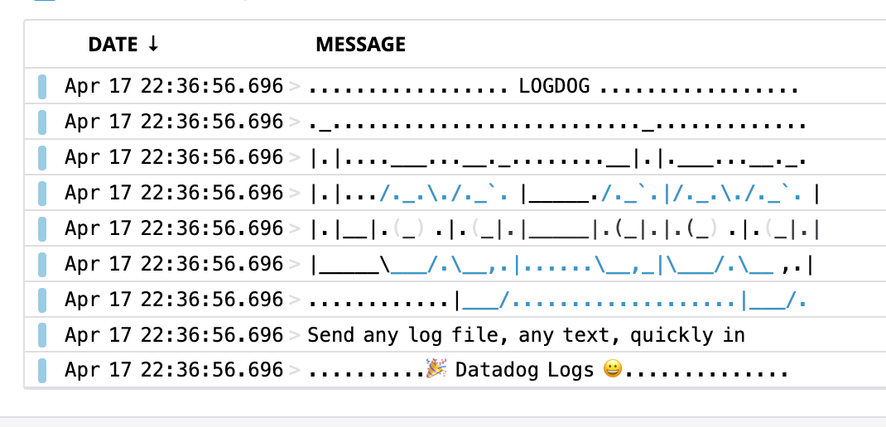

# Log dog

Send any text to datadog log quickly.

# Get it!

- [there](https://github.com/octplane/logdog/releases)

# Usage

## Configuration

- `DD_API_KEY` in your env. **mandatory**
- `DD_HOSTNAME` to target another logs endpoint **optionnal**

## Run

```shell
> cat whatever.log | logdog
https://dd.datad0g.com/logs? \
   cols=event& \
   index=main& \
   live=true& \
   query=source%3Alog-pipe+service%3Acli-client+session%3Asess[SOMERANDOMNUMBER]& \
   sort=desc& \
   stream_sort=desc
```

Open the returned url:



# Limitations

- generated URL is very stupid and use hardcoded settings everywhere
- not very well tested (help me with that)
- only macOS version for now

# Build it

```shell
cargo build --release
```

